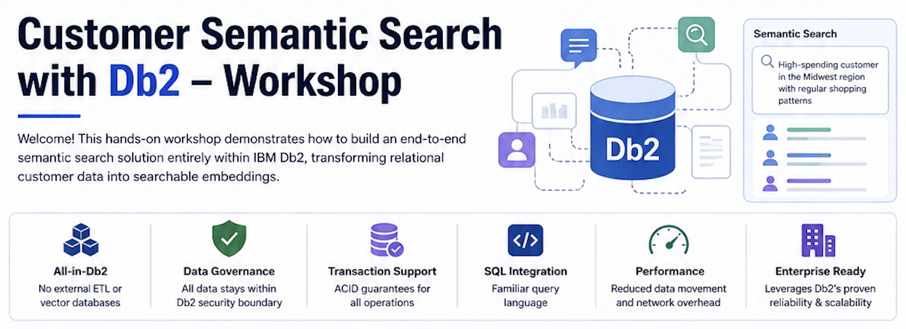
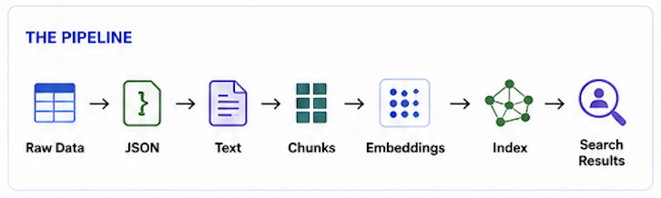
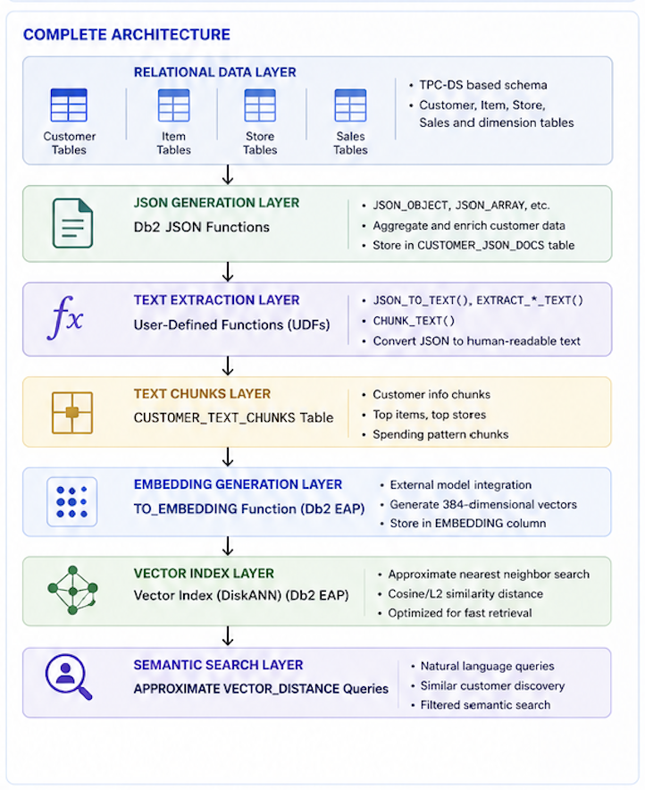

# Customer Semantic Search with Db2 - Workshop

Welcome! This hands-on workshop demonstrates how to build an end-to-end semantic search solution entirely within IBM Db2, transforming relational customer data into searchable embeddings.

## What You'll Learn

By the end of this workshop, you'll be able to:
- Transform relational data into JSON documents using Db2's native functions
- Extract and chunk text for optimal embedding generation
- Generate vector embeddings using Db2's TO_EMBEDDING function
- Create and query vector indexes for semantic search
- Execute natural language queries against structured data

## What You'll Build

A complete semantic search pipeline that enables queries like:
- "Customer who frequently purchases electronics and technology products"
- "High-spending customer in the Midwest region with regular shopping patterns"
- "Customer who returns items frequently and shops at multiple stores"
- "Find customers similar to customer ID 1"

These example queries are implemented in [sql/10_semantic_search.sql](sql/10_semantic_search.sql) and demonstrate various semantic search patterns.

### The Pipeline



Each step builds on the previous one, and by the end you'll have a fully functional semantic search system.

## Prerequisites

Before starting, ensure you have:
- **IBM Db2 with Early Access Program (EAP) features enabled** or using Db2 12.1.5+
  - **Valid license for AI/ML functions** (TO_EMBEDDING, TEXT_GENERATION)
  - Check license with: `db2licm -l`
  - If you see **SQL8029N** errors, contact IBM Support for AI license
- **Local LLM setup** (see [local_llm/README.md](local_llm/README.md))
  - llama-server binary
  - Granite 30M embedding model (384 dimensions)
  - Qwen 2.5 3B text generation model
- **Database permissions** for creating tables, UDFs, and indexes

**Important**: Steps 1-7 (data pipeline) can run without the EAP license, but steps 8-10 (embedding generation and semantic search) require TO_EMBEDDING support.

## Workshop Steps

### Quick Start: Run Everything at Once

The fastest way to complete this workshop is to use the provided automation script:

```bash
./run_all.sh
```

**What this does**:
- Automatically starts local LLM servers (embedding and text generation)
- Executes all SQL scripts in the correct order
- Generates sample data if needed
- Creates schema, loads data, generates JSON, chunks text, creates embeddings, and builds vector indexes
- Runs example semantic search queries
- Provides progress updates and error handling throughout

**When to use it**: Perfect for first-time setup or when you want to see the complete pipeline in action.

**When to run steps manually**: If you want to understand each step in detail, experiment with individual components, or troubleshoot specific issues, follow the step-by-step instructions below.

**Testing & Validation**: After running the workshop, see [TESTING_GUIDE.md](TESTING_GUIDE.md) for comprehensive testing procedures, validation queries, and troubleshooting tips to verify your setup is working correctly.

---

### Step-by-Step Instructions

Follow these steps in order if you prefer to run each component manually. Each script builds on the previous one.

### Step 0: Generate Sample Data (Optional)

If you want to customize the sample data, you can generate your own dataset with configurable parameters.

```bash
python scripts/generate_sample_data.py
```

**What this does**: Generates CSV files in the `data/` directory with synthetic customer, store, item, and transaction data. The script supports various options, please refer to the [scripts/README.md](scripts/README.md) document for details.

### Step 1: Create the Schema

Set up the database tables for customer, product, and transaction data.

```bash
db2 -tvf sql/01_create_schema.sql
```

**What this does**: Creates tables based on the TPC-DS benchmark schema, including CUSTOMER, ITEM, STORE, STORE_SALES, and supporting dimension tables. We're using TPC-DS because it represents typical relational data structures found in retail and e-commerce systems. This workshop demonstrates how traditional relational data—the kind you already have—can be transformed into powerful semantic search capabilities, all within a single database without moving data to external systems.

### Step 2: Load Sample Data

Populate the tables with sample customer data.

```bash
db2 -tvf sql/02_load_sample_data.sql
```

**What this does**: Loads enriched customer data including demographics, purchase history, and store preferences.

### Step 3: Generate JSON Documents

Transform relational data into rich JSON documents.

```bash
db2 -tvf sql/03_create_json_table.sql
db2 -tvf sql/04_generate_json.sql
```

**What this does**: Uses Db2's JSON functions to aggregate customer data from multiple tables into single JSON documents. Each document includes:
- Customer demographics
- Top 3 purchased items with spending patterns
- Top 3 stores with location details
- Monthly spending trends

JSON provides a hierarchical format that bridges relational and document models, allowing us to denormalize related data into a single, cohesive view. This unified representation captures the full context of each customer—essential for generating meaningful embeddings that understand relationships between different aspects of customer behavior.

**Example output**:
```json
{
  "customer_id": 148,
  "customer_info": {
    "name": "John Doe",
    "demographics": {
      "birth_year": 1975,
      "gender": "M",
      "education": "College",
      "income_band": "$50,000-$75,000"
    }
  },
  "top_purchased_items": [...],
  "top_stores": [...],
  "monthly_spending": [...]
}
```

### Step 4: Create and Populate Text Chunks

Convert JSON to human-readable text and split into chunks.

```bash
db2 -tvf sql/05_create_chunk_table.sql
db2 -tvf sql/06_text_chunking_udfs.sql
db2 -tvf sql/07_generate_chunks.sql
```

**What this does**:
- Creates User-Defined Functions (UDFs) to extract text from JSON
- Splits customer data into logical chunks (demographics, items, stores, spending)
- Stores chunks in a format optimized for embedding generation

**Why chunking?**: Breaking data into smaller pieces improves semantic search accuracy and allows searching specific aspects of customer behavior.

### Step 5: Generate Embeddings

Create vector embeddings using Db2's `TO_EMBEDDING` function.

**Prerequisites**: Before running this step, you must set up the local LLM servers. See [local_llm/README.md](local_llm/README.md) for detailed instructions on:
- Starting the embedding server (Granite 30M model on port 8080)
- Starting the text generation server (Qwen 2.5 3B model on port 8081)
- Verifying server health and troubleshooting

```bash
db2 -tvf sql/08_generate_embeddings.sql
```

**What this does**:
- Creates external models pointing to local LLM servers
- Calls the Granite 30M embedding model to convert text chunks into 384-dimensional vectors
- These vectors capture the semantic meaning of the text

**Note**: The `run_all.sh` script automatically starts the LLM servers if they're not already running. If running steps manually, ensure the servers are started first (see [local_llm/README.md](local_llm/README.md)).

### Step 6: Create Vector Index and Search

Build a vector index and perform semantic searches.

```bash
db2 -tvf sql/09_create_vector_index.sql
db2 -tvf sql/10_semantic_search.sql
```

**What this does**:
- Creates a DiskANN based index for fast similarity search
- Demonstrates various semantic search patterns
- Shows how to combine semantic and traditional SQL filters

**Try it**: Open [`sql/10_semantic_search.sql`](sql/10_semantic_search.sql) and experiment with different queries!

## Understanding Your Results

After completing the workshop, you can:

1. **View your JSON documents**:
   ```sql
   SELECT customer_sk, json_doc FROM CUSTOMER_JSON_DOCS LIMIT 5;
   ```

2. **Examine text chunks**:
   ```sql
   SELECT customer_sk, chunk_type, chunk_text FROM CUSTOMER_TEXT_CHUNKS LIMIT 10;
   ```

3. **Run semantic searches**:
   ```sql
   SELECT customer_sk, chunk_text,
          VECTOR_DISTANCE(embedding, TO_EMBEDDING('high spending electronics buyer' USING GRANITE30), EUCLIDEAN) as similarity
   FROM CUSTOMER_TEXT_CHUNKS
   ORDER BY similarity
   FETCH APPROX FIRST 10 ROWS ONLY;
   ```

## Data Enrichment Details

The workshop uses TPC-DS customer data enriched with:

### Top 3 Purchased Items
- Item description and categorization (category, class, color)
- Current item price
- Total spending on the item
- Return amounts
- Spending classification (very_high, high, medium, low, very_low)

### Top 3 Stores
- Store operational details (employees, division, company)
- Geographic information (city, county, state, ZIP, country)
- Customer spending and return behavior
- Net spending classification

### Monthly Spending Patterns
- Total spending per month
- Total returns per month
- Net spending (spending minus returns)
- Temporal context (year and month)
- Spending range classification

## Architecture Deep Dive

Now that you've built the system, let's understand how it works.

### Complete Architecture



### Key Technologies

| Component | Technology | Purpose |
|-----------|-----------|---------|
| Storage | Db2 Tables | Relational data storage |
| Transformation | Db2 JSON Functions | JSON document generation |
| Processing | Db2 UDFs | Text extraction and chunking |
| AI Integration | Db2 TO_EMBEDDING (EAP) | Vector embedding generation |
| Indexing | Db2 Vector Index (DiskANN) (EAP) | Fast similarity search |
| Query | Db2 SQL + Vector Functions | Semantic search execution |

### Why This Architecture Works

1. **All-in-Db2**: No external ETL or vector databases needed
2. **Data Governance**: All data stays within Db2 security boundary
3. **Transaction Support**: ACID guarantees for all operations
4. **SQL Integration**: Familiar query language for developers
5. **Performance**: Reduced data movement and network overhead
6. **Cost Efficiency**: Single platform licensing and management
7. **Enterprise Ready**: Leverages Db2's proven reliability and scalability

## Advanced Topics

### Security & Privacy

**Data Protection**:
- Encryption at rest for sensitive customer data
- Secure API key management for external models
- Row-level security for customer data access

**Compliance**:
- GDPR: Right to be forgotten (delete customer embeddings)
- Data retention policies
- Audit logging for semantic searches

### Query Patterns

**1. Text-Based Similarity Search**:
```sql
-- Find customers matching a text description
SELECT customer_sk, chunk_text,
       VECTOR_DISTANCE(embedding, TO_EMBEDDING('frequent electronics buyers with high returns' USING GRANITE30), EUCLIDEAN) as distance
FROM CUSTOMER_TEXT_CHUNKS
ORDER BY distance
FETCH APPROX FIRST 10 ROWS ONLY;
```

**2. Similar Customer Discovery**:
```sql
-- Find customers similar to a specific customer
SELECT c2.customer_sk, c2.chunk_text,
       VECTOR_DISTANCE(c1.embedding, c2.embedding, EUCLIDEAN) as distance
FROM CUSTOMER_TEXT_CHUNKS c1
JOIN CUSTOMER_TEXT_CHUNKS c2 ON c1.customer_sk != c2.customer_sk
WHERE c1.customer_sk = 148
ORDER BY distance
FETCH APPROX FIRST 10 ROWS ONLY;
```

**3. Filtered Semantic Search**:
```sql
-- Combine semantic search with traditional filters
SELECT customer_sk, chunk_text,
       VECTOR_DISTANCE(embedding, TO_EMBEDDING('luxury fashion items' USING GRANITE30), EUCLIDEAN) as distance
FROM CUSTOMER_TEXT_CHUNKS
WHERE chunk_type = 'top_items'
ORDER BY distance
FETCH APPROX FIRST 10 ROWS ONLY;
```

## Next Steps

After completing this workshop, consider:

1. **Experiment with Different Models**: Try various embedding models to compare results
2. **Tune Index Parameters**: Adjust parameters (`SEARCH_LIST_SIZE`,
   `SEARCH_BEAM_WIDTH`) for your data size
3. **Add Real-time Updates**: Implement streaming embedding generation
4. **Hybrid Search**: Combine semantic and keyword search
5. **Multi-modal Search**: Extend to include images or other data types

## Additional Resources

- **[Process Flowchart](docs/process_flowchart.md)**: Visual diagram of the complete pipeline
- **[Setup Guide](docs/setup_guide.md)**: Detailed setup instructions
- **[Query Examples](docs/query_examples.md)**: More query patterns and use cases
- **[Sample Queries](examples/sample_queries.sql)**: Ready-to-run SQL examples
- **[Early Access Program](https://early-access.ibm.com/software/support/trial/cst/programwebsite.wss?siteId=824&h=null&tabId=#whats_new)**: Download EAP Db2 and supporting documentation

## Project Structure

```
entity-customer-semantic-search/
├── README.md                         # This workshop guide
├── run_all.sh                        # Main automation script (runs entire pipeline)
├── LICENSE                           # Apache 2.0 License
├── data/                             # Sample data files (CSV format, generated)
│   ├── customer.csv
│   ├── customer_address.csv
│   ├── customer_demographics.csv
│   ├── date_dim.csv
│   ├── household_demographics.csv
│   ├── income_band.csv
│   ├── item.csv
│   ├── store.csv
│   ├── store_sales.csv
│   └── store_returns.csv
├── sql/                                             # SQL scripts (run in order)
│   ├── 01_create_schema.sql                         # Create database schema
│   ├── 02_load_sample_data.sql                      # Load sample customer data
│   ├── 03_create_json_table.sql                     # Create table for JSON documents
│   ├── 04_generate_json.sql                         # Generate JSON from relational data
│   ├── 05_create_chunk_table.sql                    # Create table for text chunks
│   ├── 06_text_chunking_udfs.sql                    # UDFs for text extraction and chunking
│   ├── 07_generate_chunks.sql                       # Generate text chunks from JSON
│   ├── 08_generate_embeddings.sql                   # Generate embeddings using local LLM
│   ├── 09_create_vector_index.sql                   # Create vector index
│   ├── 10.1_basic_semantic_search.sql               # Example semantic search 1: exact search
│   ├── 10.2_approx_search_with_index.sql            # Example semantic search 2: vector index search
│   ├── 10.2_approx_search_with_index_explain.sql    # Example semantic search 2a: explain
│   ├── 10.3_find_similar_customers.sql              # Example semantic search 3: customer similarity
│   ├── 10.4_semantic_search_with_filters.sql        # Example semantic search 4: filters
│   ├── 10.5_multi_aspect_search.sql                 # Example semantic search 5: multi-aspect search
│   ├── 11_create_llm_profile_table.sql              # create LLM profile table
│   ├── 12_generate_llm_profiles.sql                 # Generate LLM profiles using TEXT_GENERATION
│   ├── 13_chunk_llm_profiles.sql                    # Chunk LLM profiles
│   ├── 14_generate_llm_embeddings.sql               # Generate embedding for Chunked LLM profiles
│   ├── 15.1_llm_semantic_search.sql                 # Example semantic search using chunked LLM profiles
├── scripts/                          # Data generation scripts
│   ├── README.md                     # Scripts documentation
│   └── generate_sample_data.py       # Generate custom sample data
├── local_llm/                        # Local LLM setup (PREREQUISITE)
│   ├── README.md                     # LLM setup instructions
│   ├── bin/                          # llama-server binaries and libraries (after build)
│   │   └── llama-server              # LLM server executable
│   ├── models/                       # Downloaded GGUF models
│   │   ├── granite-embedding-30m-english-Q6_K.gguf  # Embedding model (384-dim)
│   │   └── qwen2.5-3b-instruct-q4_k_m.gguf          # Text generation model
│   └── llama-cpp/                    # llama.cpp source for local build (reference)
├── docs/                             # Additional documentation
│   ├── architecture.md               # System architecture details
│   ├── process_flowchart.md          # Visual process diagram
│   ├── query_examples.md             # Query examples and use cases
│   └── setup_guide.md                # Detailed setup instructions
└── examples/                         # Example queries
    └── sample_queries.sql            # Sample queries for testing
```

## Troubleshooting

**Embedding generation fails**:
- Verify `TO_EMBEDDING` function is configured with valid API credentials
- Check external model endpoint is accessible
- Ensure model name matches your configuration

**Vector index creation is slow**:
- Normal for large datasets (can take several minutes)
- Consider reducing `BUILD_LIST_SIZE` parameter for faster builds (default is 50, but lower values may reduce search quality)
- Adjust `MAX_NODE_DEGREE` for trade-off between build time and search quality
- Use smaller data sample for initial testing

**Search returns no results**:
- Verify embeddings were generated successfully
- Ensure vector index was created
- Increase `SEARCH_LIST_SIZE`, `BEAM_WIDTH` or the value of `K` in `FETCH FIRST <K>`

## Contributing

This is a demonstration project. Feel free to adapt it for your specific use cases.

## License

Apache License 2.0 - See LICENSE file for details
